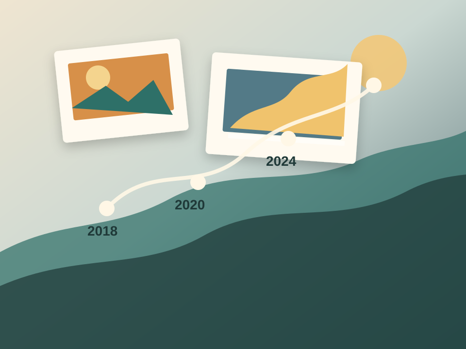

# Timeline

**Private timelines, portable forever.**

A local-first tool for creating simple life, travel, project, or career timelines that are easy to export and share. Nothing is stored online: timelines live in your browser and are imported and exported as files you control.



## What it does

- **Local-first.** Drafts autosave in your browser (IndexedDB). There is no account and no server.
- **Open format.** A timeline saves as a small, readable JSON file (`*.timeline.json`) that anyone can edit or build on. See [the format](#json-format).
- **Shareable stand-alone playback.** Export a single `.timeline.html` file that plays your timeline with no server needed. Choose a player:
  - **Simple:** a plain list of events.
  - **Timeline:** a chart of events over time, with range bars, a date scrubber, search and filters.
  - **Slideshow:** a full-screen photo slideshow with event details and auto-advance.
  - **Map:** a map of events that have a location, with photos, collections and stepping from event to event.
- **Photos and places.** Attach photos and a location to any event. The editor can look up coordinates for a place name, or you can pick a point on the map.
- **Flexible.** Embed photos in the file or link them by URL. Sort events into categories with your own labels and emoji, group them into collections, span a range of time, and add custom fields to any event.

The map player and the coordinate lookup need internet access, to load map tiles and search for places (OpenStreetMap, Nominatim and Photon, plus optional Esri and VersaTiles imagery). Everything else works offline.

## Run locally

There is no build step and no npm dependencies. You need Python (for a static file server) and a modern browser.

```sh
python scripts/dev_server.py --restart
```

or:

```sh
python -m http.server 8000 --bind 127.0.0.1
```

Then open <http://127.0.0.1:8000/>. The editor uses browser IndexedDB, so run it through a local server instead of opening the files directly. Exported `.timeline.html` files can be opened straight from disk.

## Try it

1. Open `editor.html` and add a few events.
2. **Save to JSON** for an editable backup, or **Save to HTML** for a stand-alone viewer that embeds the player, the timeline and any photos.
3. Open `player.html` and pick or drop a `.timeline.json` file to view it.

## Project layout

- `index.html` is the product page, and `json-format.html` documents the file format.
- `editor.html` creates, imports and exports timelines.
- `player.html` opens a timeline JSON file and plays it.
- `src/timeline.js` defines and validates the shared timeline schema.
- `src/db.js` stores the active editor draft in IndexedDB.
- `src/*Player.js`, `src/*Model.js` and `src/htmlExport.js` hold the players and the stand-alone export.
- `vendor/leaflet/` is a vendored copy of [Leaflet](https://leafletjs.com/), used by the map player.
- `scripts/` holds the dev server and the checks; `tests/fixtures/` holds schema fixtures.

## Documentation

- [docs/player-contract.md](docs/player-contract.md): requirements for the stand-alone export and the rules every player follows. Read this before writing your own player.
- [docs/players/](docs/players/): one behavior spec per player.
- [todo.md](todo.md) is the backlog.

## Check JavaScript and schema fixtures

```sh
python scripts/check_js.py
```

The checker runs `node --check` on the browser JavaScript, then the schema, export, map, slideshow and layout tests. It needs `node` on PATH (or the standard Windows Node install when run from WSL).

## JSON format

Timelines use format `local-timeline-poc`, currently schema version `10`. Field-by-field documentation is in [json-format.html](json-format.html) (open it from the running app), and the reference implementation is [src/timeline.js](src/timeline.js).

### Example

```json
{
  "format": "local-timeline-poc",
  "version": 10,
  "title": "Untitled timeline",
  "updatedAt": "2026-06-25T00:00:00.000Z",
  "eventTypes": [
    { "value": "misc", "label": "Misc", "emoji": "📌" },
    { "value": "life", "label": "Life", "emoji": "✨" },
    { "value": "family", "label": "Family", "emoji": "👨‍👩‍👧‍👦" },
    { "value": "friends", "label": "Friends", "emoji": "🤝" },
    { "value": "health", "label": "Health", "emoji": "🩺" },
    { "value": "home", "label": "Home", "emoji": "🏠" },
    { "value": "school", "label": "School", "emoji": "🎓" },
    { "value": "travel", "label": "Travel", "emoji": "✈️" },
    { "value": "work", "label": "Work", "emoji": "💼" },
    { "value": "conference", "label": "Conference", "emoji": "🎤", "custom": true }
  ],
  "collections": [
    { "id": "collection-uuid", "kind": "collection", "title": "Japan 2026" }
  ],
  "media": [
    {
      "id": "image-uuid",
      "kind": "image",
      "mimeType": "image/jpeg",
      "dataUrl": "data:image/jpeg;base64,...",
      "width": 960,
      "height": 640,
      "originalName": "photo.jpg",
      "encodedAt": "2026-06-25T00:00:00.000Z"
    }
  ],
  "events": [
    {
      "id": "uuid",
      "type": "work",
      "title": "Started a new project",
      "timestamp": {
        "date": "2026-06-25",
        "time": "09:00",
        "tz": "America/Vancouver"
      },
      "endTimestamp": {
        "date": "2026-06-27",
        "time": "17:00",
        "tz": "America/Vancouver"
      },
      "location": "Vancouver, BC",
      "geo": { "lat": 49.28273, "lng": -123.12074, "source": "search" },
      "collectionIds": ["collection-uuid"],
      "images": [
        {
          "id": "gallery-item-uuid",
          "kind": "embedded",
          "mediaId": "image-uuid",
          "caption": "Launch day"
        },
        {
          "id": "gallery-link-uuid",
          "kind": "link",
          "url": "https://example.com/photo.jpg",
          "caption": ""
        }
      ],
      "fields": [
        {
          "id": "uuid",
          "key": "role",
          "label": "Role",
          "type": "text",
          "value": "Lead developer"
        }
      ]
    }
  ]
}
```

### Compatibility

Current exports use schema version `10`.

- Optional `events[].endTimestamp` (same `date` / `time` / `tz` shape as `timestamp`) marks events that span a range, such as "lived in Vancouver 2015-2020". An end that is earlier than the start, or has no date, is dropped with a warning on import.
- Optional `events[].geo` (`{ "lat", "lng", "source" }`) gives an event a place on the map. `lat` (-90 to 90) and `lng` (-180 to 180) are numbers, kept to 5 decimal places. `source` is `"search"` (filled in by the editor's online lookup), `"map"` or `"manual"`; a missing or unknown one counts as `"manual"`. `location` stays as the human-readable label. A `geo` that isn't a valid point is dropped with a warning.
- Optional top-level `hiddenEventTypes[]` lists built-in event type slugs (never `misc`) left out of `eventTypes[]`. Without it, every built-in type is present. A type that an event still uses is never hidden.
- Newer same-format files are accepted when possible. Known fields are normalized, unknown fields are preserved, and schema diagnostics are shown in the editor load dialog plus the browser console.
- Recoverable inconsistencies, such as missing defaults, malformed fields, duplicate event IDs, and missing media references, are logged as warnings or errors while still loading as much timeline data as possible.

Uploaded images are previews, not archives: each is resized to at most 960px and re-encoded as JPEG (quality 0.72) with metadata removed, and the original is not kept. For full quality, link the image by URL instead of uploading it (see the note on linked images in the save dialog).

In IndexedDB, the active draft stores the timeline document and media records separately. Media bytes are stored as Blobs there and are converted back to data URLs when the draft loads. In JSON and standalone HTML exports, the same media records are included in top-level `media[]` so the artifact remains self-contained.

## Debugging

Debug in your normal browser with DevTools. To inspect the draft in Chrome or Edge, open DevTools, go to **Application > Storage > IndexedDB**, and look for the `timeline-poc` database.

## Privacy

Avoid committing exported timelines with private data, browser downloads, or large media files. `*.timeline.json`, `*.timeline.html` and the `examples/` folder are git-ignored for this reason.
